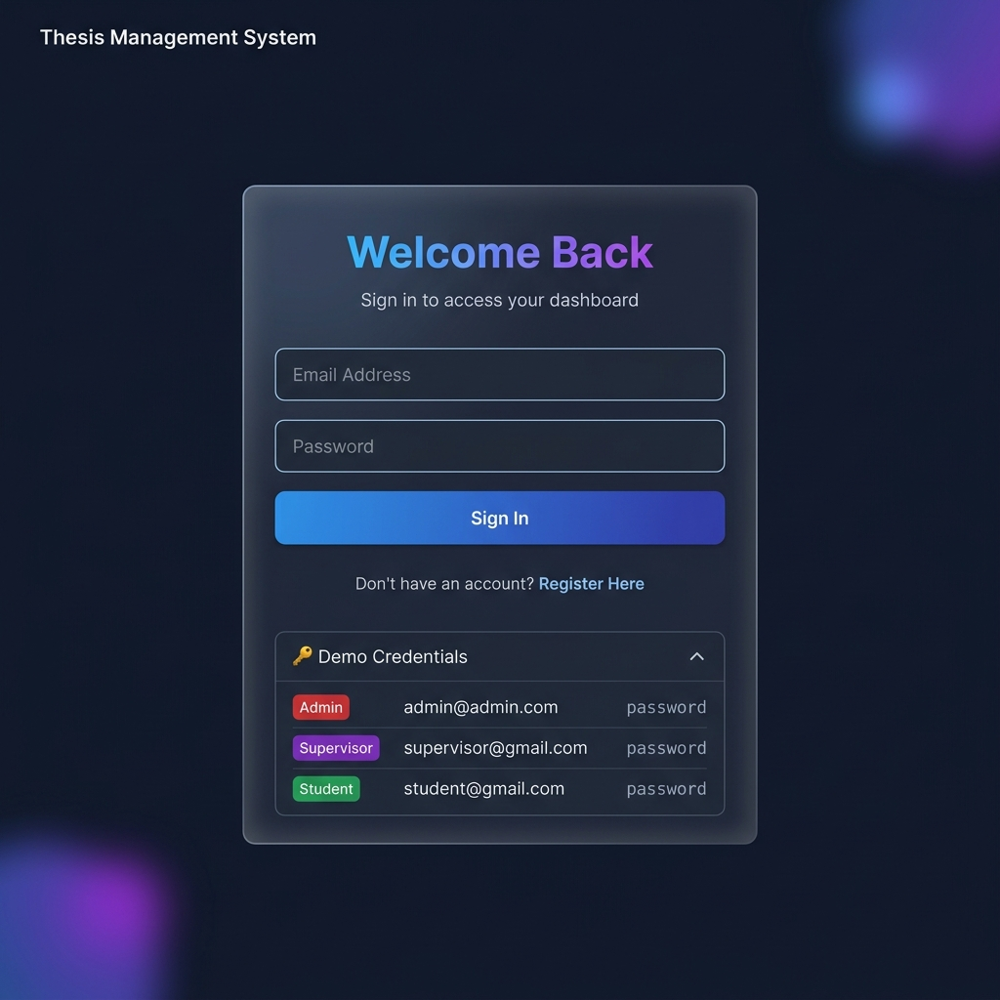
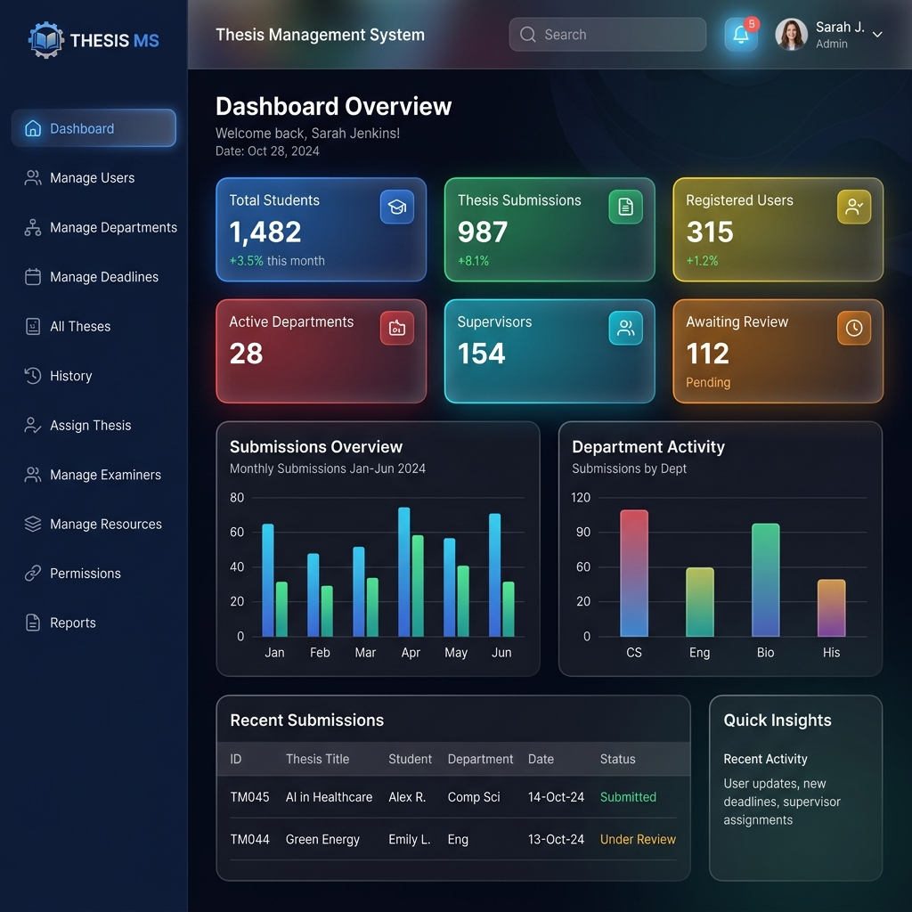

<div align="center">

# 🎓 Thesis Management System

**A full-featured, role-based web platform for managing the entire academic thesis lifecycle — from proposal submission to final approval.**

[](https://php.net)
[](https://mysql.com)
[](https://apachefriends.org)
[](LICENSE)

</div>

---

## 📌 About This Project

The **Thesis Management System** is a web-based platform built for universities to streamline and digitize the thesis submission and review process. It provides three distinct role-based portals — **Admin**, **Supervisor**, and **Student** — each with a tailored dashboard and set of tools.

Students can submit proposals, upload chapters, and track feedback in real time. Supervisors review and approve submissions, provide structured feedback, and manage their assigned cohorts. Administrators have full system control — managing users, departments, deadlines, examiners, resources, and generating reports.

The system features a modern, dark glassmorphism UI built entirely with vanilla PHP, MySQL, and CSS — no heavy frameworks required.

---

## 📸 Screenshots

| Login Page | Admin Dashboard |
|:---:|:---:|
|  |  |

> **Note:** To add real screenshots, run the project locally, take screenshots, and save them to `assets/screenshots/`.

---

## 🚀 How to Use

### Prerequisites
- [XAMPP](https://www.apachefriends.org/) (Apache + MySQL + PHP 8.x)
- A modern web browser (Chrome, Firefox, Edge)

### Step-by-Step Setup

**1. Clone / Download the Project**
```bash
git clone https://github.com/your-username/thesis_management_db.git
```
Or download the ZIP and extract it.

**2. Place in XAMPP Web Root**
```
Copy the folder to:  C:\xampp\htdocs\thesis_management_db\
```

**3. Import the Database**
- Open your browser and go to: `http://localhost/phpmyadmin`
- Click **"New"** and create a database named `thesis_management_db`  
  *(or simply run the SQL file — it creates the database automatically)*
- Click **"Import"** → choose the file `database.sql` from the project root → click **"Go"**

**4. Configure Database Connection** *(if needed)*

Open `config/db_connect.php` and update these values to match your XAMPP setup:
```php
$host    = "localhost";
$user    = "root";      // Your MySQL username
$pass    = "";          // Your MySQL password (blank by default in XAMPP)
$db_name = "thesis_management_db";
```

**5. Start XAMPP Services**
- Open the XAMPP Control Panel
- Start **Apache** and **MySQL**

**6. Open the Application**
```
http://localhost/thesis_management_db/
```

---

## 🔑 Default Login Credentials

The database comes pre-seeded with three default accounts. All passwords are `password`.

| Role | Email | Password |
|------|-------|----------|
| 🔴 **Admin** | `admin@university.edu` | `password` |
| 🟣 **Supervisor** | `supervisor@university.edu` | `password` |
| 🟢 **Student** | `student@university.edu` | `password` |

> ⚠️ **Security Note:** Change these passwords immediately if deploying to a production/public server.

---

## ✨ Features

### 👨‍🎓 Student Portal
| Feature | Description |
|---------|-------------|
| **Dashboard** | Overview of submission counts, approval status, and thesis timeline |
| **Submit Proposal** | Submit new thesis proposals with title, abstract, domain, and supervisor selection |
| **My Thesis** | Upload chapters, view supervisor feedback, and track revision status |
| **Assigned Projects** | View pre-assigned thesis topics offered by supervisors |
| **Messages** | Communicate with supervisors directly within the platform |

### 👨‍🏫 Supervisor Portal
| Feature | Description |
|---------|-------------|
| **Dashboard** | Overview of supervised students, pending reviews, and activity metrics |
| **Pending Requests** | Approve or reject thesis proposals from students |
| **My Students** | List of all currently supervised students with quick access to their work |
| **Review Thesis** | Read submissions, annotate with feedback, request revisions, or approve chapters |
| **Assign New Project** | Create and assign thesis topics directly to students |
| **Department Students** | Broad view of all students in the supervisor's department |
| **Manage Classes** | Group students into classes/cohorts and track group-level progress |

### 🛡️ Admin Portal
| Feature | Description |
|---------|-------------|
| **Dashboard** | System-wide stats with interactive Chart.js charts (submissions, departments) |
| **Manage Users** | Create, edit, delete, approve, and assign roles to all users |
| **Manage Departments** | Add/edit academic departments and view department-level data |
| **Manage Deadlines** | Set system-wide deadlines for proposals, chapters, and defenses |
| **All Theses / History** | Complete view of all ongoing and past thesis records |
| **Assign Thesis** | Admin override to manually assign theses between students/supervisors |
| **Manage Examiners** | Assign internal/external examiners to thesis defense committees |
| **Manage Resources** | Upload and share guidelines, templates, and documents for all users |
| **Permissions** | Fine-tune page-level access control per role |
| **Reports** | Generate statistical reports on completions, departments, and system usage |

---

## 🛠️ Tech Stack

| Layer | Technology |
|-------|-----------|
| **Backend** | PHP 8.x (procedural + mysqli) |
| **Database** | MySQL 8.x |
| **Frontend** | HTML5, Vanilla CSS3 (Glassmorphism, Flexbox, Grid) |
| **UI / Icons** | Font Awesome 6, Google Fonts (Outfit) |
| **Charts** | Chart.js (Bar, Doughnut) |
| **Web Server** | Apache (via XAMPP) |
| **Sessions** | PHP native sessions for auth |
| **Password Hashing** | PHP `password_hash()` / `password_verify()` (BCrypt) |

---

## 🔮 Future Integrations / Roadmap

- [ ] **Email Notifications** — Automated emails via PHPMailer/SMTP on status changes
- [ ] **REST API** — Expose endpoints for mobile app integration
- [ ] **File Preview** — In-browser PDF viewer for uploaded thesis documents
- [ ] **Real-time Chat** — WebSocket-based messaging between students and supervisors
- [ ] **Plagiarism Check** — Integration with third-party plagiarism detection APIs
- [ ] **Two-Factor Auth (2FA)** — TOTP-based 2FA for admin accounts
- [ ] **Multi-Language Support** — i18n framework for multilingual institutions
- [ ] **Advanced Analytics** — Export reports to PDF/Excel with more granular filters
- [ ] **Notification Center** — In-app push notifications with read/unread tracking
- [ ] **Dark/Light Mode Toggle** — User preference theme switcher

---

## 📁 Project Structure

```
thesis_management_db/
│
├── 📄 index.php                    # Entry point → redirects to login
├── 📄 dashboard.php                # Unified role-based dashboard (Admin & Student)
├── 📄 database.sql                 # Complete DB schema + default seed data
├── 📄 README.md                    # This file
├── 📄 User_Guidelines.md           # Detailed user-facing feature guide
│
├── 📂 auth/                        # Authentication pages
│   ├── login.php                   # Login page (with demo credentials panel)
│   ├── register.php                # New user registration
│   ├── logout.php                  # Session destroy & redirect
│   ├── profile.php                 # User profile management
│   ├── deadlines.php               # Public deadline viewer
│   ├── resources.php               # Public resources viewer
│   └── mark_read.php               # Mark notifications as read
│
├── 📂 admin/                       # Admin-only pages
│   ├── dashboard.php               # Redirect stub → root dashboard.php
│   ├── all_theses.php              # View all theses system-wide
│   ├── assign_new_project.php      # Assign new thesis projects
│   ├── assign_thesis.php           # Re-assign existing theses
│   ├── history.php                 # Past thesis records
│   ├── manage_deadlines.php        # Deadline management
│   ├── manage_departments.php      # Department CRUD
│   ├── manage_examiners.php        # Examiner assignment
│   ├── manage_resources.php        # Resource upload/management
│   ├── manage_users.php            # Full user management
│   ├── permissions.php             # Role-based access control
│   ├── reports.php                 # Statistical reports
│   └── view_department.php         # Department detail view
│
├── 📂 supervisor/                  # Supervisor-only pages
│   ├── dashboard.php               # Supervisor-specific dashboard
│   ├── assign_new_project.php      # Create & assign thesis projects
│   ├── department_students.php     # Department-wide student view
│   ├── manage_classes.php          # Class/cohort management
│   ├── my_students.php             # List of supervised students
│   ├── pending_requests.php        # Pending proposal queue
│   ├── review_thesis.php           # Thesis review & feedback tool
│   └── view_class.php              # Class detail view
│
├── 📂 student/                     # Student-only pages
│   ├── dashboard.php               # Redirect stub → root dashboard.php
│   ├── assigned_projects.php       # View assigned thesis topics
│   ├── messages.php                # Student messaging
│   ├── my_thesis.php               # Thesis management & chapter uploads
│   └── submit_proposal.php         # New proposal submission
│
├── 📂 config/
│   └── db_connect.php              # DB connection + activity logger helper
│
├── 📂 includes/                    # Shared layout partials
│   ├── header.php                  # HTML head + session check
│   ├── navbar.php                  # Top navigation bar
│   ├── sidebar.php                 # Role-aware sidebar menu
│   ├── footer.php                  # Footer + scripts
│   └── permission_handler.php      # Page-level permission enforcement
│
├── 📂 assets/
│   ├── css/
│   │   ├── style.css               # Main application stylesheet
│   │   └── auth.css                # Auth pages stylesheet
│   ├── js/                         # JavaScript files
│   └── img/                        # Static images
│
└── 📂 uploads/                     # User-uploaded thesis documents (gitignored)
```

---

## 🤝 Contributing

1. Fork the repository
2. Create your feature branch: `git checkout -b feature/amazing-feature`
3. Commit your changes: `git commit -m 'Add amazing feature'`
4. Push to the branch: `git push origin feature/amazing-feature`
5. Open a Pull Request

---

## 📄 License

This project is licensed under the **MIT License** — see the [LICENSE](LICENSE) file for details.

---

<div align="center">
Built with ❤️ for academic excellence
</div>
